[Home](index.md) |
[Hardware Plan](hardware-plan.md) |
[Hardware](Hardware.md) |
[Graphical User Interface](GUI.md) |
[Human Interaction](human-interaction.md) |
[Design](robot-design.md) |
[Reflections](reflections.md)

# Graphical User Interface

### Contents
- [Initial Prototype](#intitialprototype)
- [UX Research](#uxresearch)
- [Final Preperations](#final-preparations)

## Initial Prototype

### Language
Initially when I satrted coding I was coding in python 3, but when the roomba was not working we realised that it would only work in python 2.7. I then had to convert the GUI code to python 2.7.

for example:

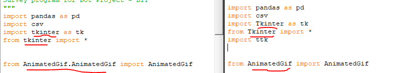

### Tkinter

To create the GUI I decided that I would try using Tkinter. I had never used it before so this was a big learning curve. To get me started I tried out some practice runs, trying to just get a basic GUI working. 

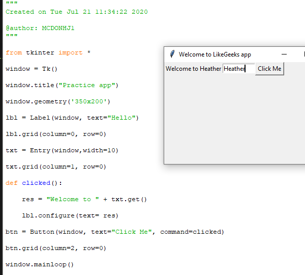

I then started messing around with buttons showing different pages as I wasn't sure how I would be able to switch to each question.

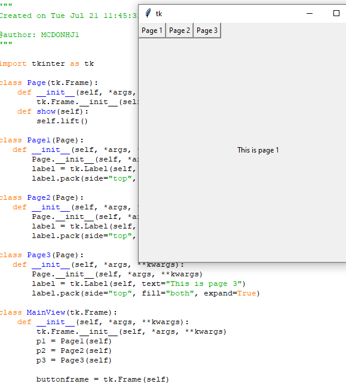

I also tried out just the most basic of quizes using Tkinter and went from there.

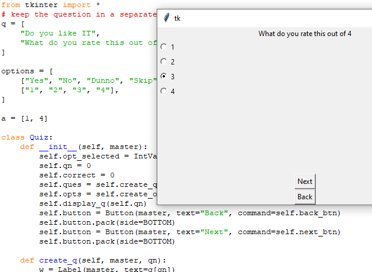

### The First Prototype

#### Code

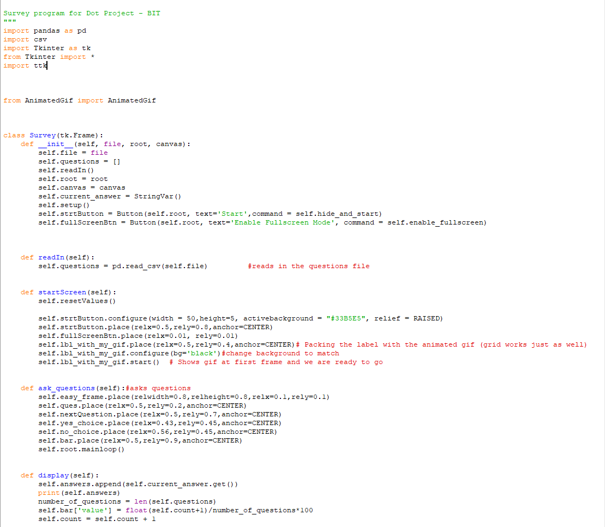
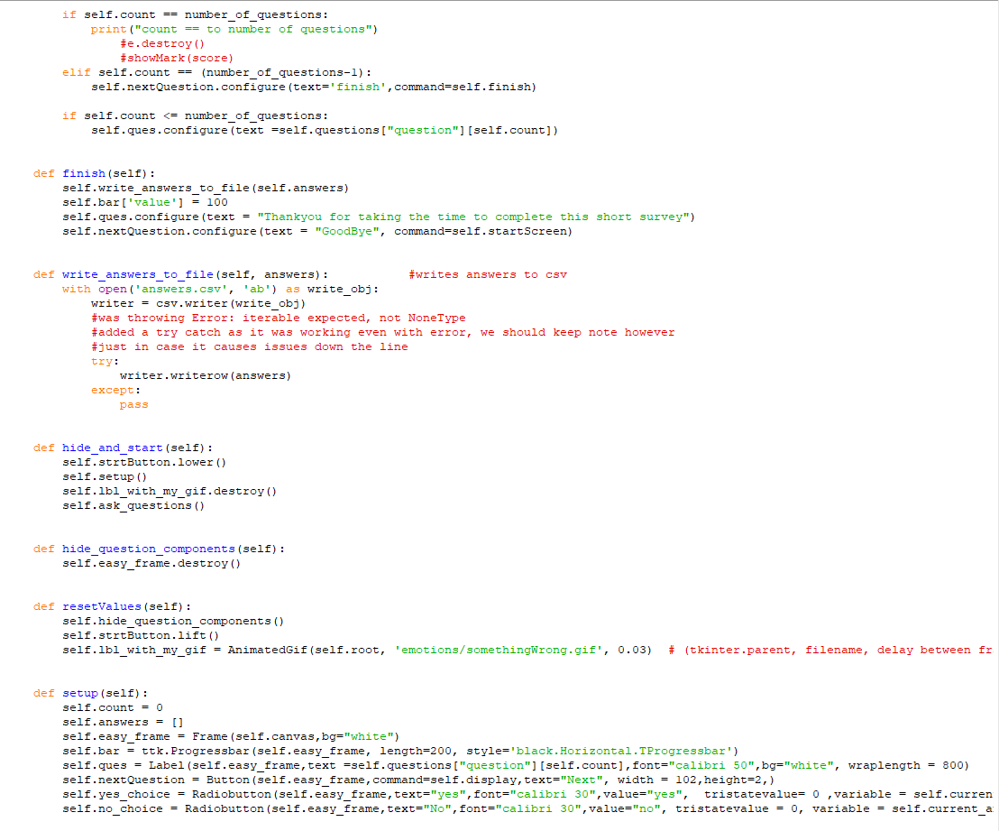
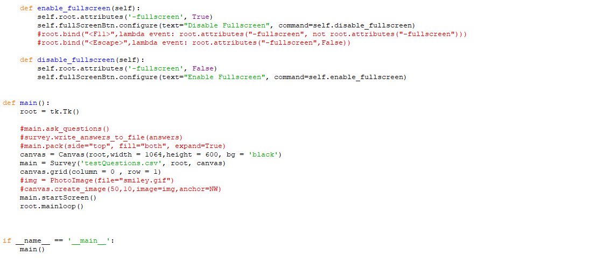

#### GUI Screenshots

##### Front Screen

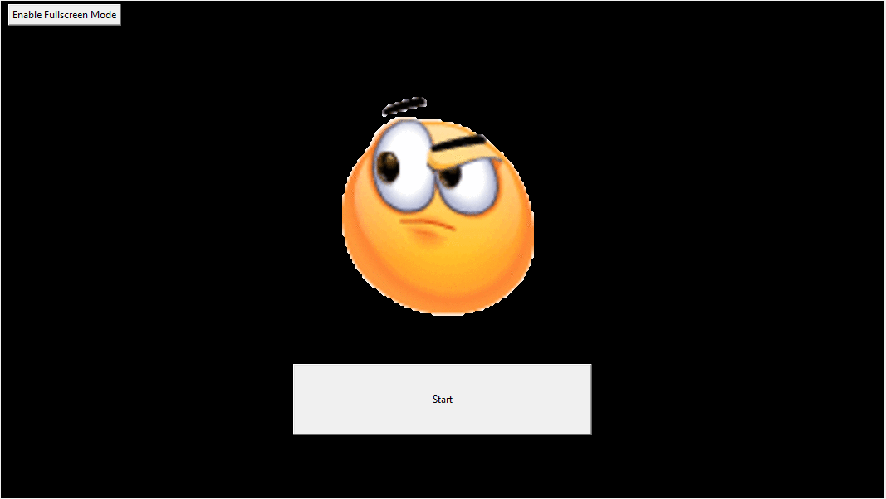

##### Question Screens

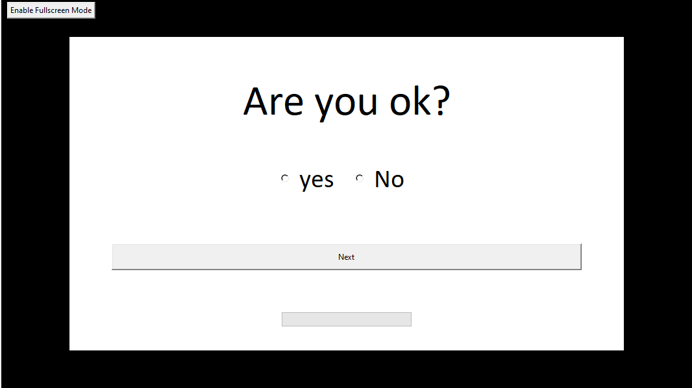

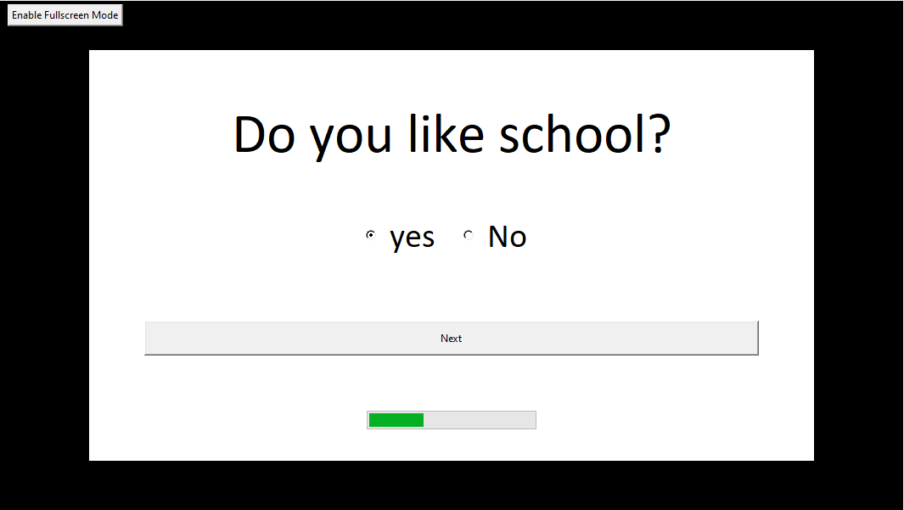

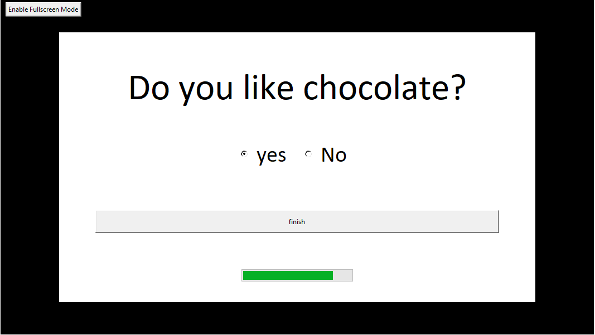

##### End Screen

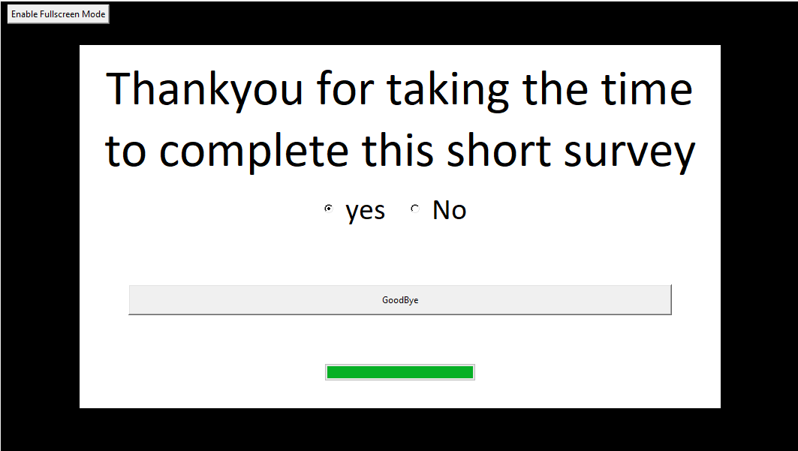

Once you press goodbye it will take you to the first screen again so the next person can start.

----------------------
## UX Research

### Three UX research techniques I chose
-
#### Competitive Analysis

Competitive analysis provides an overview of the current state of the market by allowing you to examine and compare your User Interface with similar products that are already out in the market. The focus of competitive analysis is User Experience.

I believe this is suited to my situation as I can compare my User Interface with other products to see how my User Experience could be improved to suit and compete in the current market. This research would also be useful as a guide of what people would expect to see in a survey User Interface.

#### Design Review – Standalone Design Critique

A design review is a _usability-inspection method in which a reviewer examines a design to identify usability problems [nngroup.com]._ There are several different methods of design review including Heuristic Evaluation, Standalone Design Critique and expert Review. I chose to focus on Standalone Design Critique.

Standalone Design Critique is a method of Design Review where an in-progress design is analyzed to establish whether it provides a good User Experience. This method is done in a group where there are two roles; the presenter, which presents the product, and the critiquer, which offers educated thoughts and a different viewpoint. This is an iterative process that happens with several iterations of the design of the product.

I chose this method of design review as I believe that it would be extremely beneficial to get my fellow group members perspective of my initial design of the User Interface. They will be able to input their ideas which I may not have thought of or see features that should be improved on to improve the User Experience of our product.

#### Prototype Feedback &amp; Testing (clickable prototype)

Prototype Feedback and Testing can be done on paper prototypes or clickable prototypes. I have chosen to use my current prototype that I have coded. The clickable prototype will allow the user the full experience of using the actual product.

Prototype Feedback and Testing, requires you to watch users use your prototype. While they are using the prototype, you must take note of how good your current design is at allowing them to complete the task at hand. The purpose is not to gather opinions, it is to notice if there are any areas in your design that could be improved on, thus making the end goal easier to achieve for users in the next iteration of the prototype.

This method of User Experience Research fits well with where I am at in the design process of my User Interface. I have completed the first clickable prototype so this would be the perfect opportunity to see how users react to using it. I can then see where I need to improve my design to make the User Experience better for the user.

### Perform each technique and document how you went about using that technique

#### Competitive Analysis

To correctly perform the Competitive Analysis method for my User Experience research on my product I found a template of how to proceed and the questions I should be answering in this research technique. This site had great in-depth information on each step that should be taken. I will be comparing my product with survey tools and user interfaces that are predominantly web based which will give me a broader spectrum of products to compare with, as comparing it to another robot that has a survey interface will be harder to find and make comparisons with. As I am focusing mainly on the survey portion of the project I believe this is the correct path to take.

Below are the steps that I took to complete this research technique.

##### Outline my goals and define my product:

The goal of this research is to compare the qualities, strengths and weaknesses of my product, compared to others that are already on the market.

##### Compile a list of direct and indirect competition:

**Direct Competition** (High Priority)

- [Survey Monkey](https://www.surveymonkey.com/): an online tool for creating online surveys and is currently one of the most popular survey platforms online.
- [TypeForm](https://www.typeform.com/surveys/): another online tool for creating online surveys that uses different templates that are visually appealing.
- [Zoho](https://survey.zoho.com.au/): online survey maker tool very similar to survey monkey in design.
- [freeonlinesurveys](https://freeonlinesurveys.com/): online survey maker tool like TypeForm.
- [Google Forms](https://docs.google.com/forms/u/0/): online form maker that allows you to create surveys.

**Indirect Competition** (Low Priority)

- [Quibblo](https://www.quibblo.com/take/survey): A site that you can take random surveys at. Has a very basic User Interface.

##### Create a list of features compare:

| **Feature** | [**Survey Monkey**](https://www.surveymonkey.com/) | [**TypeForm**](https://www.typeform.com/surveys/) | [**Zoho**](https://survey.zoho.com.au/) | [**freeonlinesurveys**](https://freeonlinesurveys.com/) | [**Google Forms**](https://docs.google.com/forms/u/0/) | [**Quibblo**](https://www.quibblo.com/take/survey) |
| --- | --- | --- | --- | --- | --- | --- |
| **One question per page** | No
 | Yes
 | No
 | No
 | No
 | No
 |
| **Return to previous question** | Yes
 | Yes – small arrows in bottom right corner
 | Yes as all on same page | Yes as all on same page | Yes as all on same page | Yes as all on same page |
| **Colour scheme** | Black text/white background | Mixture – some with images as backgrounds and coloured text | Black text/white background | Different themes, colourful | Black text/white background with colour on outer background and image at top | Black text/white background with coloured numbers next to question |
| **Next button** | Yes

 | No - automatic | No – all questions on same page | No | No | No
 |
| **Progress bar** | Yes – bottom of screen, with text saying how many question have been answered | Yes – bottom right of screen, text with percentage of how much of survey completed | No | No | No | Yes – top of survey, text 0 of 8 questions completed |
| **Requires all questions answered** | Yes, with error message displaying if not answered | Yes, no way of moving to next question until you answer | No – can submit survey without answering a single question | No – can submit survey without answering a single question | Can set certain question to be required – error message displays if required question not answered | Yes, with error message displaying if not answered |
| **Done/Submit button once finished** | Done | Submit | Submit | Finish Survey | Submit | Submit |
| **Splash Screen** | No
 | Yes – title of survey, button tell us what you think | No | No | No | No |

##### Identify the differences between my product and competitors

| **Feature** |
 |
| --- | --- |
| **One question per page** | Yes |
| **Return to previous question** | No |
| **Colour scheme** | Black text/White Background with black border |
| **Next button** | yes |
| **Progress bar** | Yes – bottom middle |
| **Requires all questions answered** | No |
| **Done/Submit button once finished** | Finish then another screen that says thankyou and button that says goodbye |
| **Splash Screen** | Emoji gif, button that says start on black background |

I will Summarize my findings and devise my strategies in the next section of this report in &quot;[Document the results of your research](#_Competitive_Analysis)&quot;

#### Design Review – Standalone Design Critique

I decided to have the design critique with my other group members in my project. The first thing I did was let everyone know the objective of the discussion so that everyone knew what was to be discussed. I explained that I would present the prototype User Interface and that they would take turns, using the round robin technique, to either share something good about the design, or some aspect of the design that they feel could be improved.

Using the round robin technique meant that everyone had a chance to voice their opinions. I felt this was the easiest way to keep everyone on topic, with no one talking over each other.

While presenting, I explained what parts of the prototype are placeholders for the future, for example, the gif emoji on the splash screen. I kept this short so as not to influence their opinions. Once I finished the presentation, I picked someone to go first, then they took turns sharing their opinions of the design. We kept it short and concise so that we did not start straying from the purpose of the meeting.

I will discuss the good design features, and features that could be improved upon, during the design critique in the next section of this report in &quot;[Document the results of your research](#_Design_Review_%E2%80%93)&quot;.

#### Prototype Feedback &amp; Testing (clickable prototype)

For the testing I decided that it would be best to do the unmoderated approach, which for me meant sitting down with the user and allowing them to use the prototype without any input from me. I had three people use my prototype, which gave me a little more perspective on what I should improve for the next iteration.

While they used the prototype I just sat quietly and watched while taking a few notes. Some also shared opinions on what they think of the prototype, and what they thought could be changed to make it easier for them to use.

If I had more time I feel it would have been very constructive to find more people to do this with. This would have given me a better idea of what a wider variety of people were all similarly struggling with or found easy to use with my prototype.

I will discuss my findings in the next section of this report in &quot;[Document the results of your research](#_Prototype_Feedback_&amp;)&quot;.

### Results of research

#### Competitive Analysis

Through my thorough research of other similar products online I found that a lot of the online products shared the same qualities including;

- Having more than one question on the same page.
- The ability to return to the previous question.
- Theme of black text on white background.
- Having no next button, instead opting for automatically going to next question once the current one had been answered.
- Requiring all questions to be answered with error messages displaying if they have not been answered.
- A submit button at the end of the final question.
- Not having a splash screen.

I have found multiple User Experience problems with my User Interface by doing this research and comparing it with these similar products

- I believe that one question per page though not a standard feature in many of the products I researched, is a feature that I do not want to change in my product. I believe that it suits the requirements of my product better than having multiple questions display on the screen at once.
- I believe the ability to go to a previous question is a feature that I should add to my product as this will improve the User Experience by allowing users to change their answers if they mis-click or change their mind.
- I really like the idea of not having a next button, so I believe I should change my product so that it automatically goes to the next question once the user picks their answer. This will improve the User Experience by cutting down on the number of clicks the user must do.
- I will be adding restrictions and error messages to my product as at the moment a user could go through the entire survey without answering any of the questions.
- My product has a lot of pointless screens at the end of it and button clicks that don&#39;t need to be there. I believe I should change it to a Submit button on the final question and a screen that says thankyou to the user, then after 5 seconds it should automatically go back to the starting splash screen.
- Though many products do not have a splash screen I believe that this is also a feature I do not want to take away from my product. The products that did have a splash screen that I researched felt nicer than the ones that did not.

#### Design Review – Standalone Design Critique

During the design critique several good and bad features of my prototype design were addressed including;

##### Good features:

- The Progress Bar was a great addition and the placement was in a position that made sense to the rest of the layout.
- The full screen button was a good idea as it enabled users to easily enable and disable the full screen on a touch screen without the use of a keyboard.
- Having everything centered draws the user in so they can see all the important information.

##### Features to improve on:

- The progress bar would be better if it had some sort of text either inside or next to it to further indicate to users what it was calculating.
- The full screen button might make more sense to be on the right side of the screen as that is where users would usually go to maximize a window.
- The next and start buttons seemed off balance with the rest of the layout, they might be better shorter lengthways but have a larger height to make it easier for the user to hit with their finger.
- The extra screen at the end that requires a button push to get back to the splash screen meant that users may just leave and not realize they had one more button to push, leaving the survey not ready for another person to start.

#### Prototype Feedback &amp; Testing (clickable prototype)

During the testing most of the users found the same problems or got stuck on a few of the same parts of my prototype;

- Not knowing what the product was until pressing the start button.

I found this confused them as they were just faced with a black screen, an emoji and a start button. They didn&#39;t know what they were starting. I should fix this for the next iteration, as this is an easy fix of just adding a simple title on the splash screen with some information about what the survey is about.

- There were some mis-clicks which either meant that they had not answered the question or answered something but wanted to change what they had answered after clicking to the next question by accident.

This is something that I have already outlined in the above sections that I need to fix in the next iteration, by adding error checking and adding the feature of being able to go back to the previous questions.

- Radio buttons

Though the text next to the radio button symbol is clickable as well, I noticed some people were clicking the radio symbol instead of the text. This symbol is quite small compared to the text and I worry that when this gets put onto a touch screen people might have issues and accidently click the yes instead of the no. To fix this I believe I should change the radios to be normal buttons.

- Progress Bar

On the very first question the progress bar is just an empty rectangle at the bottom of the screen. Some of the users tried clicking it to see if it was a button. This would waste the users time. Implementing text to the progress bar to show what it is from the start of the survey, will avoid this confusion.

- Final Screen

On the final screen the yes and no radio buttons are still there even though they are not actually being used at this point of the survey. This made for a little bit of confusion so I should remove them from that screen for the next iteration of my prototype.

### References

_Design Critiques:__Encourage a Positive Culture to Improve Products_. (2020). Retrieved 25 August 2020, from [https://www.nngroup.com/articles/design-critiques/](https://www.nngroup.com/articles/design-critiques/)

_The Complete Guide to a UX Competitive Analysis | WANDR - Ranked #1 Product Strategy &amp; UX Design Firm_. (2020). Retrieved 25 August 2020, from [https://wandr.studio/competitive-analysis-ux/](https://wandr.studio/competitive-analysis-ux/)

_UX Research Cheat Sheet._ (2020). Retrieved 25 August 2020, from https://www.nngroup.com/articles/ux-research-cheat-sheet/

## Final Preparations

- Joel created some GIF's to be used as DOT's face but they were not working with my program. I found a GIF optimiser online and managed to drop duplicate frames from the GIF's. This made them work perfectly with my program.

- Tried to use Text to Speech API from IBM Watson but the are no longer supporting Python 2.7. Instead I found another tts system that uses the platforms tts. I have manged to get it working on windows but may have to do a few different things to get it working on the Rasp Pi.

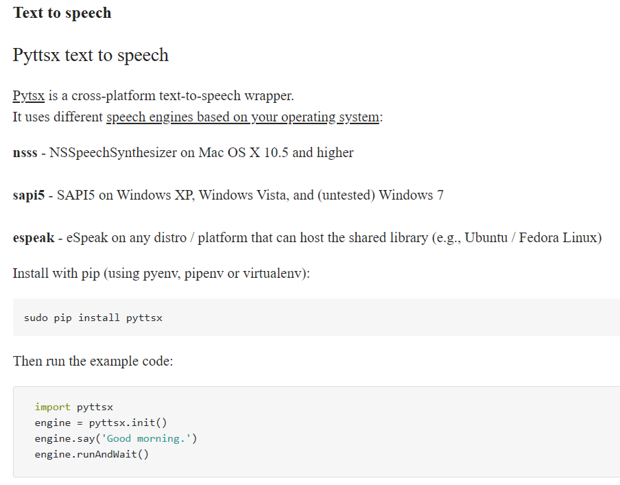

I also had to install some more dependencies to get it working:

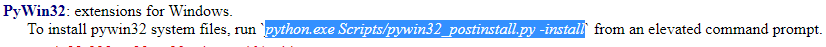

- I have incorperated two of joels GIFs one at the start and then one at the end:

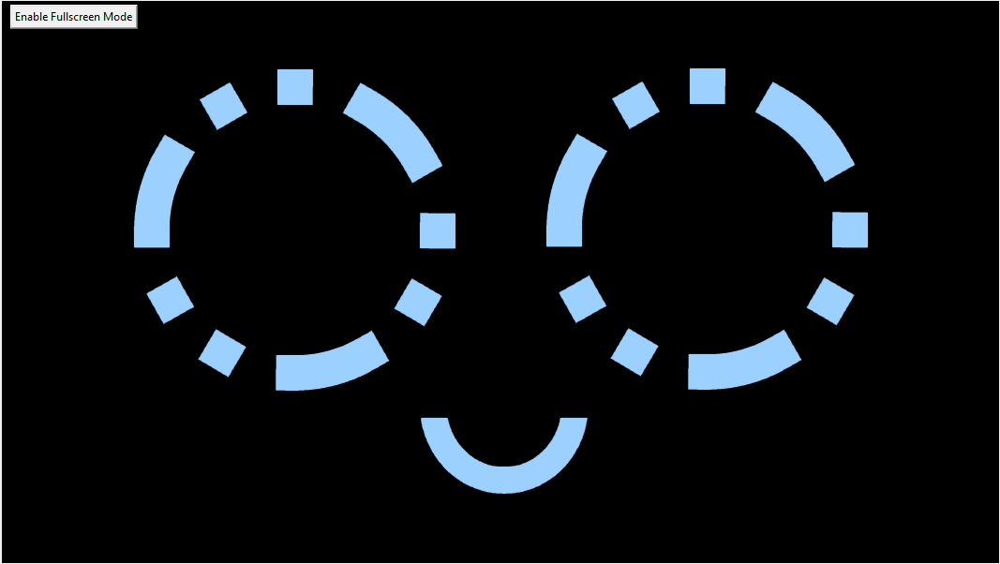
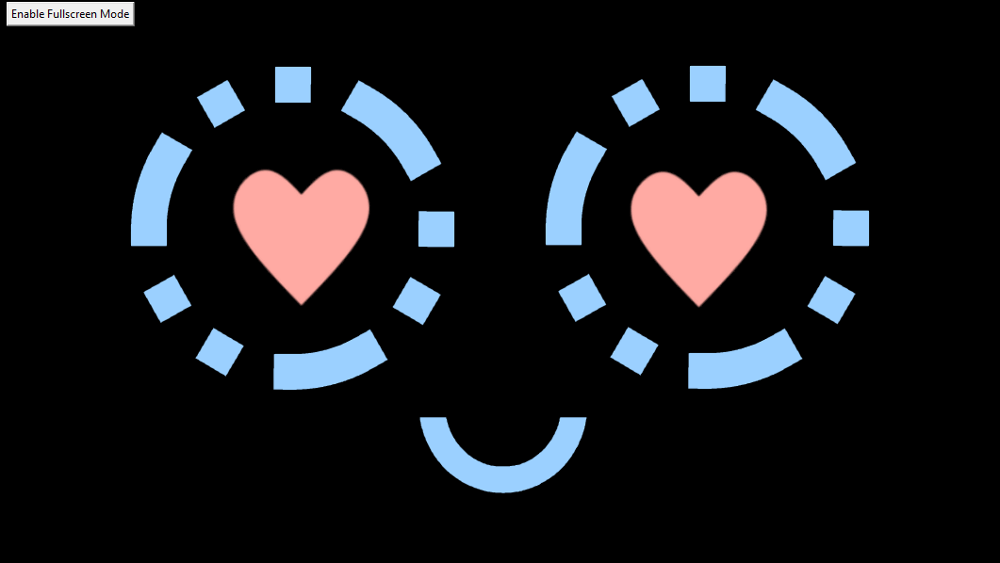

- To get the GUI working on DOT with the program to make it drive we had to put the two programs together. Initially I tried getting the driving class and added it to the GUI program, but it was throwing some errors which I deducted was because both classes were using the tkinter object which was causing issues. So I took the code that was in the driving class and put the functions inside the survey class. There were portions of code that I had to add to the survey init/constructor to make this work. After a some time of working through alot of errors I managed to make it so that the GUI itself looked for the keystrokes from the controller, so that The GUI is showing on the screen you can move DOT easily without having to click out of the GUI.

[Here is a link to the commit where I did this](https://github.com/Jayden-Caldwell/Dot/commit/bef8f709faac1827e4b8f860b89b185c2ff7921e#diff-4cc1216f64aeb3ceab3a4c651cbede3bfb8d2ad2952bdadf19249c859a16a59a)

- Once the driving was working inside the GUI I started working on making the GUI look better and fit to the touchscreen. I changed the size of the tkinter window, moved the positioning of the radio buttons, changed the size of the text and where it should wrap, and changed colours of the buttons so that it was a bit more user friendly.

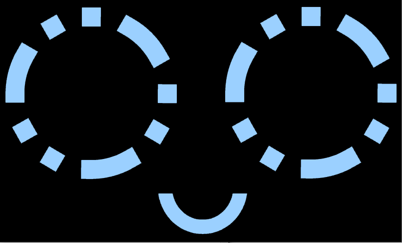

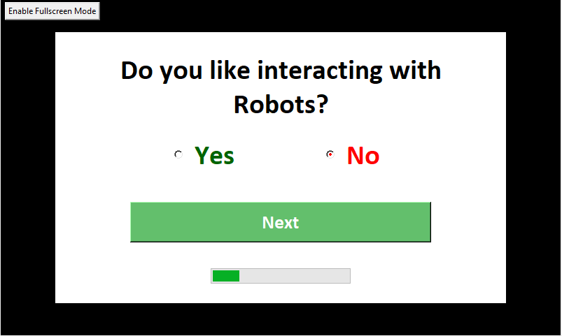

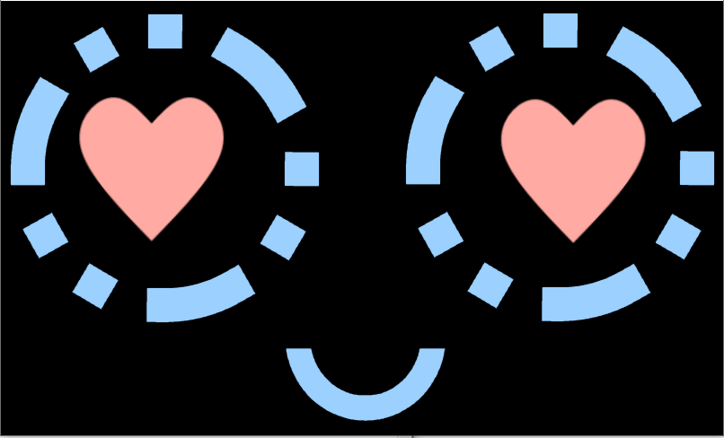

- I decided that it would be better to make the GUI be fullscreen on startup so I added the code to the main function to do this and changed the initial fullscreen button to be to disable fullscreen.

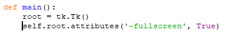
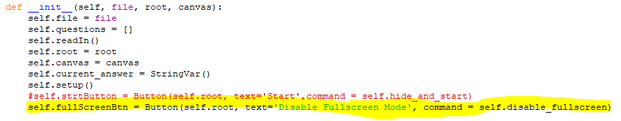

- I also decided to change the questions so that they were more relevent to the upcoming event. 

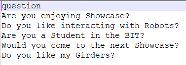

The last question is more of an inside joke amongst our team, but I am pretty sure everyone will say yes to that question.

- After testing the GUI I realised that the mouse curser was sort of pointless on a touchscreen so I found the code needed to hide the curser and added it the program.

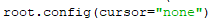

- We also decided that it would be cool to have the program boot up on startup, so now when you turn on the rasp pi it automaticlly starts up the GUI/Driving program so as soon as you turn everything on you can pick up the controller and GO.

