# Contents

- [Home](index.md)

# Intoduction
Hardware makes up a large portion of our robotics project from 3D printing, soldering, drilling, building and much more. Below I demonstrate the key things that we did that outline what we learnt whether they work or were a disaster.

# Solder
Soldiering was very important for the project as we needed to supply our raspberry pi with 5 volts of electricity, but this was coming from a battery that read 12.9 volts on the multi-meter. If we plugged this in directly to the Pi it would overwhelm it and in return destroy the PI (This happened btw). To get around this issue we needed something to step the voltage down to 5 volts. Below is a video of me soldering a chip that we were going to put on a breadboard as our voltage converter. This did not go to plan and instead we got another chip and soldered 4 wires to it. This was better than the chip and breadboard setup as it was more modular. The new voltage converter allowed you to change the voltage that it was passed through by turning a small dial, this made it very helpful when we were running into problems with 5 volts not being enough for the raspberry pi and touch screen. Because of this we turn the dial to the right a small amount giving the pi 5.2 volts which in doing so removed the warning on the screen saying there was not enough power.

<iframe width="560" height="315" src="https://www.youtube.com/embed/u_7Dsir4nNE" frameborder="0" allow="accelerometer; autoplay; encrypted-media; gyroscope; picture-in-picture" allowfullscreen></iframe>

# Component Housing
To store our Raspberry pi, voltage converter and battery we created a sketch and 3D printed a holder, this can be seen below. After we put this together, we decided to wire in a switch so you could use that to turn the voltage converter on and off and in doing so the Raspberry pi and the touch screen.

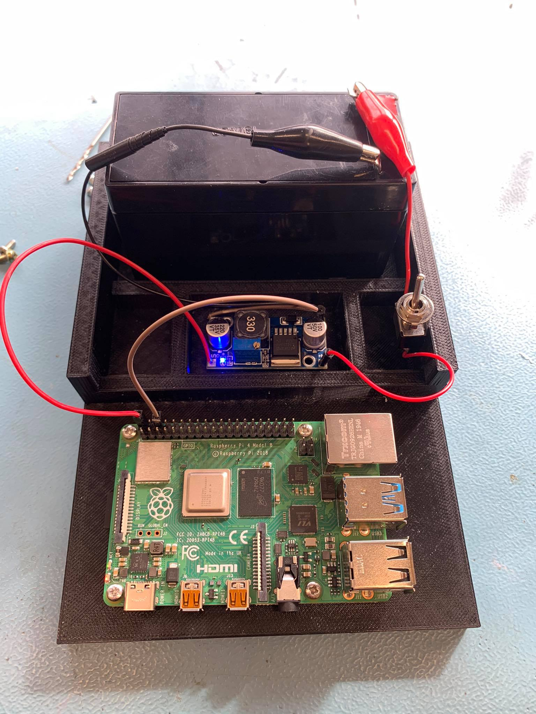 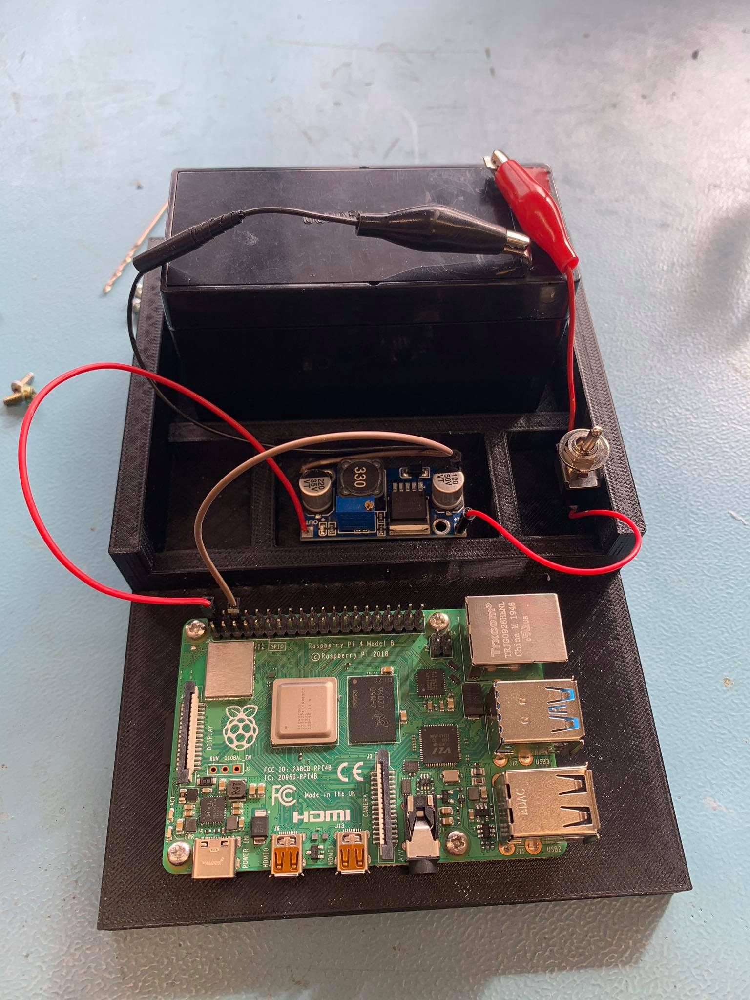 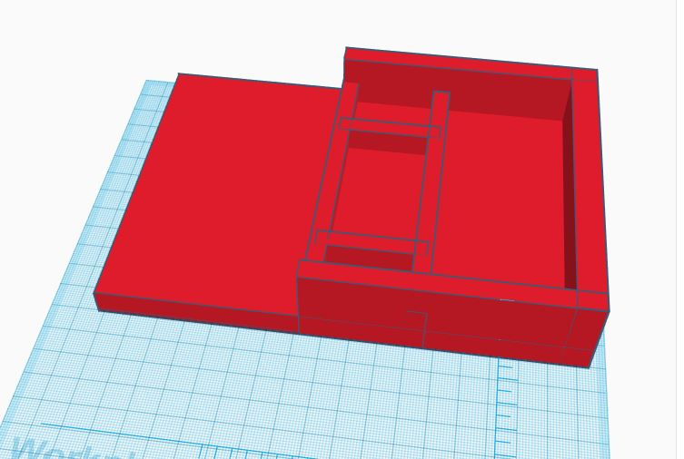

This is our first test to make sure the battery was correctly powering the raspberry pi before we secured all the hardware into the housing

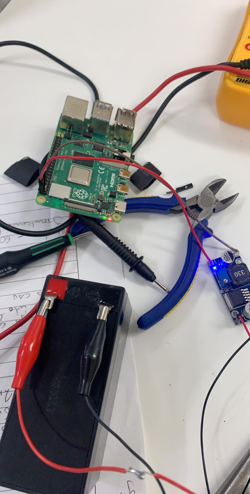

The pictures above show the component housing in its 2 states, on and off. The other image is of the prototype that was to be 3D printed. The idea was to separate each component to make it look cleaner and to give us some space to route cables. It was not until after all the components were installed that we decided to put in a switch, but this was great idea.    

### Here is a video of the switch in action:

<iframe width="560" height="315" src="https://www.youtube.com/embed/aqs5S3J1gq4" frameborder="0" allow="accelerometer; autoplay; encrypted-media; gyroscope; picture-in-picture" allowfullscreen></iframe>

# 3D Printing

A big part of our project relied on the 3D printers such as girders, mounts, holders and the component housing. Some of this didn’t go as planned. The girders were printed off earlier in semester when we weren’t having issues with the printers, but this quickly changed. After that a lot of our prints were interrupted by either the filament snapping or the nozzle blocking and with the Dremel if this happened the head needed to be pulled apart which took a few hours. This was diffidently a big road block in our overall productivity, especially when some of the items we were printing were taking 12 hours at a time and if anything was to go wrong during this process you would have to start from scratch again.

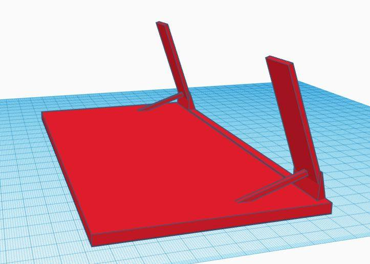

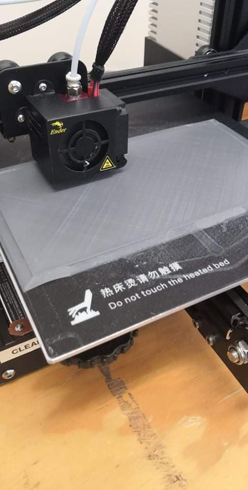 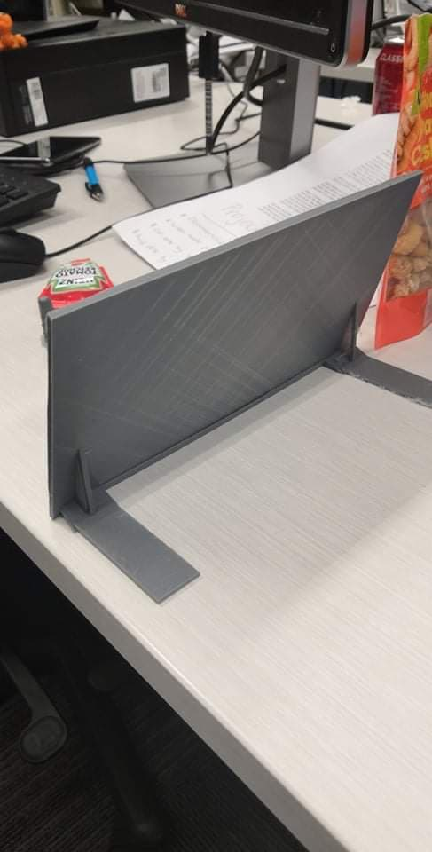 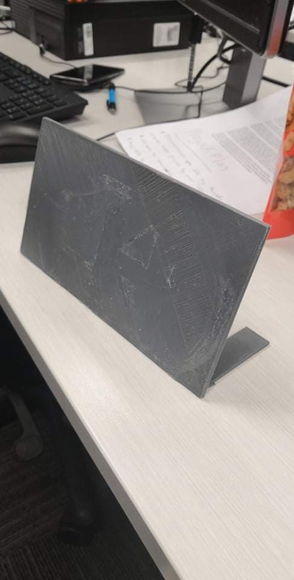

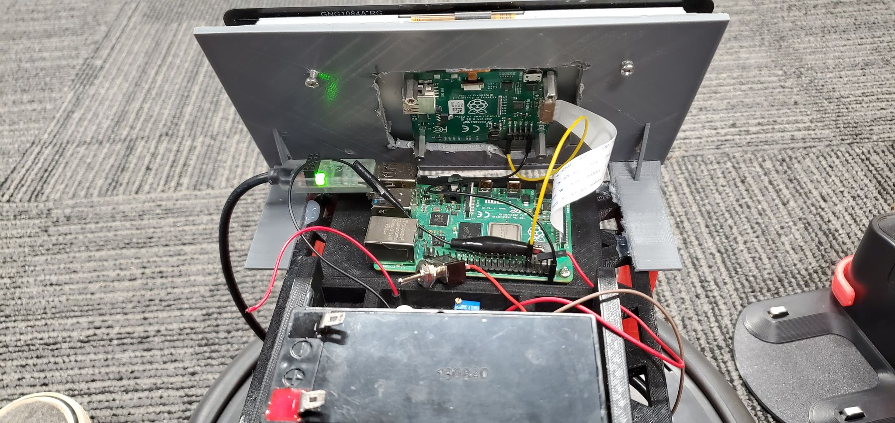 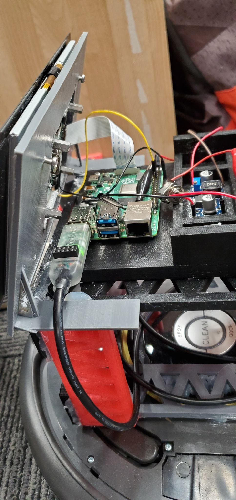 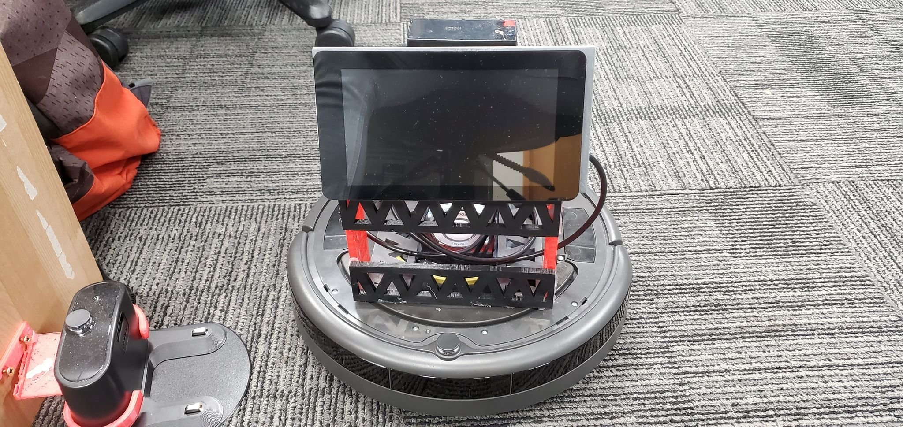

