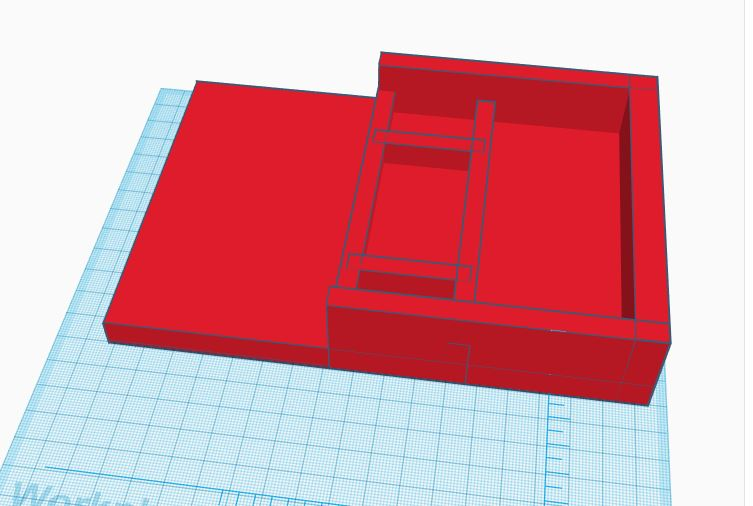

[Home](index.md) |
[Hardware Plan](hardware-plan.md) |
[Hardware](Hardware.md) |
[Graphical User Interface](GUI.md) |
[Human Interaction](human-interaction.md) |
[Design](robot-design.md) |
[Reflections](reflections.md)

### Building the component housing

  

<iframe width="560" height="315" src="https://www.youtube.com/embed/aqs5S3J1gq4" frameborder="0" allow="accelerometer; autoplay; encrypted-media; gyroscope; picture-in-picture" allowfullscreen></iframe>

### 3D Printing

<iframe width="560" height="315" src="https://www.youtube.com/embed/FedGwf_0wrI" frameborder="0" allow="accelerometer; autoplay; encrypted-media; gyroscope; picture-in-picture" allowfullscreen></iframe>

