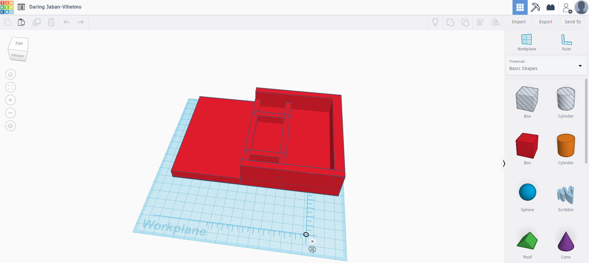

[Sprints](Sprints.md)

### Building the component housing

  

<iframe width="560" height="315" src="https://www.youtube.com/embed/aqs5S3J1gq4" frameborder="0" allow="accelerometer; autoplay; encrypted-media; gyroscope; picture-in-picture" allowfullscreen></iframe>

